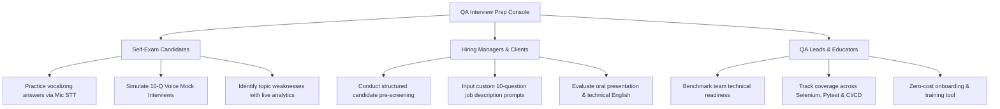
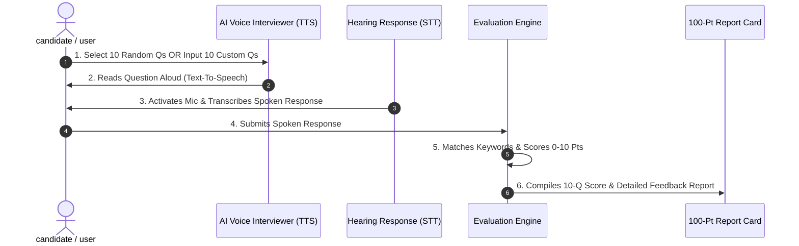

# 🧪 QA Automation & SDET Interview Prep Console

[](https://opensource.org/licenses/MIT)
[](https://developer.mozilla.org/en-US/docs/Web/API/Web_Speech_API)
[](#-qa-interview-domains-covered)
[](#-zero-cost--zero-dependency-architecture)

Welcome to the **QA Automation & SDET Interview Preparation Platform**. This application is an interactive, serverless interview console and AI voice examiner featuring **110+ hand-crafted Software Testing & SDET Interview Questions and Answers**.

It is designed for **Self-Exam Candidates**, **Hiring Managers**, **Recruiters**, and **QA Leads** looking to practice, benchmark technical knowledge, and conduct voice-based technical interviews.

---

### 🚀 Live Demo App: [https://rahman-pro.github.io/qa-interview-prep/](https://rahman-pro.github.io/qa-interview-prep/)

*Click the link above to launch the application directly in your browser. Enter access code **`1234`** to verify and start practicing instantly!*

---

## 🎯 Target Audiences & Value Propositions



### 1. 🎓 For Self-Exam Candidates (QA Engineers, Manual Testers, SDETs)
- **Vocal Presentation Practice:** Don't just read answers—speak them! Test your ability to articulate complex technical topics under pressure.
- **Instant Keyword Grading:** Get rated from **0 to 10 points** per question based on key industry concepts and technical vocabulary.
- **Weakness Analysis:** Automatically track low-performing topics (e.g., Pytest Fixtures, Selenium Stale Elements, CI/CD Pipelines) so you know exactly what to study next.

### 2. 💼 For Hiring Managers, Recruiters & Corporate Clients
- **Candidate Pre-Screening:** Conduct structured, standardized technical pre-interviews.
- **Custom Question Lists:** Input your company's own **10 custom job description questions** into the Audio Interview engine.
- **Hearing & Speech Assessment:** Evaluate candidate listening skills (Text-To-Speech questions) and English technical vocabulary (Speech-To-Text responses).

### 3. 👥 For QA Leads & Engineering Teams
- **Team Skill Benchmarking:** Use the 12 technical categories to onboard junior testers and level up team members in Python automation, POM design patterns, and GitHub Actions CI/CD.

---

## 🎧 10-Question Audio Interview Exam Engine

The platform features an **AI Voice Interviewer** that simulates a live 10-question technical screening:



### Key Capabilities of Audio Exam Mode:
* **Mode A (🎲 10 Random Qs):** Shuffles 10 random questions across all 12 QA & SDET categories.
* **Mode B (📝 Custom 10 Qs):** Paste your own custom 10 questions (e.g. from a specific job description or team checklist).
* **Text-To-Speech (TTS):** The AI interviewer speaks each question out loud with an animated sound wave indicator.
* **Speech-To-Text (STT):** Automatically captures spoken answers using your microphone and displays real-time transcription.
* **100-Point Scorecard:** Delivers a complete report card showing overall percentage, pass/fail status, spoken transcript vs reference answer, and matched key concepts.

---

## 🚀 Key Features Overview

| Feature | Description | Benefit |
| :--- | :--- | :--- |
| **🎧 Audio Exam Mode** | 10-question voice interview with TTS questions & STT answer capture. | Prepares you for real verbal phone/video technical interviews. |
| **🎯 110+ Handcrafted Q&A** | Comprehensive questions covering Python, Selenium, Pytest, CI/CD, Git, API & Frameworks. | Eliminates guesswork on what hiring managers ask. |
| **📊 Weakness Map Analytics** | Topic performance bars showing percentage mastery across categories. | Directs your study time to your lowest-scoring topics. |
| **🏆 Gamified Achievements** | 8 unlockable achievement badges (First Step, Hot Streak, Sharpshooter, Champion). | Keeps learning engaging and rewarding. |
| **🔒 100% Free & Standalone** | Uses browser-native Web Speech APIs and `localStorage`. | $0.00 cost forever, zero paid APIs, zero server costs. |
| **🌙 Dark / Light Mode** | Styled with modern glassmorphic UI tokens and Google Fonts (Outfit & Fira Code). | Premium visual comfort for long study sessions. |

---

## 🧠 QA Interview Domains Covered (110+ Questions)

```
┌─────────────────────────────────────────────────────────────────────────┐
│                        QA & SDET INTERVIEW CURRICULUM                   │
├──────────────────────────────┬──────────────────────────────────────────┤
│ 🟢 Behavioral & Soft Skills  │ STAR method, Bug Prevention, ROI         │
│ 🟡 Python Fundamentals        │ Data structures, Decorators, Exceptions  │
│ 🐍 Python Advanced SDET      │ Requests API, SQL DB, Subprocess, OAuth  │
│ 🔵 Selenium WebDriver        │ POM, ActionChains, Locators, Stale Elem  │
│ 🟣 Pytest Framework          │ Fixture Scopes, Conftest, Parametrize    │
│ 🟠 Framework Architecture    │ Folder Layout, Design Patterns, Scaling  │
│ 🔴 CI/CD & GitHub Actions    │ Workflows, YAML, Secrets, Triggers       │
│ 🟤 Allure Visual Reports     │ Attachments, Severity, History Trends    │
│ ⚫ Testing Methodologies      │ Smoke, Sanity, BVA, Equivalence, SEO     │
│ 🔶 Scenario-Based Challenges │ Flaky Tests, Redesign Fixes, OAuth Mock  │
│ 🔷 Git & Team Collaboration  │ Branching, Rebase vs Merge, Conflicts    │
│ 💡 Ask the Interviewer       │ Highlighting initiative in 90 days       │
└──────────────────────────────┴──────────────────────────────────────────┘
```

---

## 🛠️ How to Run & Deploy

### Option 1: Standalone Single File (Zero Setup)
1. Download or clone this repository:
   ```bash
   git clone https://github.com/Rahman-Pro/qa-interview-prep.git
   ```
2. Double-click `index.html` to open it in Chrome or Edge.
3. Enter sandbox access code **`1234`** and start practicing!

### Option 2: Deploy to GitHub Pages (Free Hosting)
1. Push this repository to your GitHub account.
2. Go to **Settings -> Pages**.
3. Under **Branch**, select `main` and `/root`, then click **Save**.
4. Your site will be live at `https://<your-username>.github.io/qa-interview-prep/`.

---

## 🔒 Zero-Cost & Zero-Dependency Architecture

This platform is intentionally engineered to run **100% free forever**:

- **Speech-To-Text (STT):** Powered by the browser's native `webkitSpeechRecognition` API.
- **Text-To-Speech (TTS):** Powered by the browser's native `SpeechSynthesisUtterance` API.
- **Evaluation & Scoring:** Powered by fast client-side JavaScript keyword matching algorithms.
- **Data Persistence:** Stored locally via browser `localStorage`.

*No credit cards, no paid OpenAI/Gemini API keys, and no monthly server bills required.*

---

## 👨‍💻 Author & Connect

- **Developer:** Atiqur Rahman (QA Automation & SDET Specialist)
- **LinkedIn:** [Atiqur Rahman on LinkedIn](https://www.linkedin.com/in/atiqur-rahman-pro/)
- **GitHub:** [Rahman-Pro Portfolio](https://github.com/Rahman-Pro)
- **Projects:** [SleepApneaBD Healthcare Suite](https://sleepapneabd.com)

---

### 🌟 If you find this project helpful for your interview preparation, give it a Star on GitHub!
